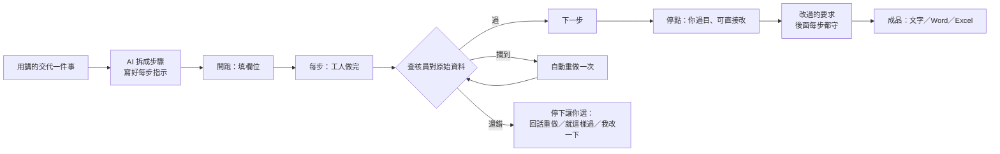

<div align="center">

# 剝繭 · bojian

**把你常做的事，變成愈用愈聰明的流程。**

本地網頁介面 · 掛在你自己的 Claude Code 上跑 · 資料全在你電腦，預設不回傳任何東西

[](LICENSE)
[](https://github.com/ceruleanstring/bojian/releases)
[](https://nodejs.org)
[](#參與開發)
[](https://claude.com/claude-code)

[快速開始](#快速開始) · [它怎麼運作](#三十秒看懂) · [交貨先查](#交貨先查) · [常見問題](#常見問題) · [路線圖](#路線圖)

</div>

> **English:** *bojian* turns recurring work into workflows that get smarter every run. Describe a task, the AI breaks it into steps; every step's output is checked against your source data before it moves on; edits you make at review points become rules for the rest of the run. Local web UI, runs on your own Claude Code login, no server, no account, all data stays on your machine. Chinese-first UI.
> `git clone https://github.com/ceruleanstring/bojian.git && cd bojian && npm install && node src/server.js` → http://127.0.0.1:8787

---

## 為什麼有剝繭

每次請 AI 做同一件事，你都得重講一遍背景、格式、禁忌；講完它做出來的東西還是每次不一樣；數字對不對、有沒有自己編，要你自己一行一行對。

剝繭把這三件事收掉：

- **講一次就好。** 你用講的交代一件常做的事，AI 拆成步驟、寫好每一步的指示，存成流程。之後每次用，改的是欄位，不是重講。
- **交出去之前先查。** 每個 AI 步驟做完，另一個獨立的查核員拿原始資料對成品：數字對不上、無中生有、沒守你的要求，攔下來自動重做；還錯才停下問你。
- **你改過的，它記得。** 在停點改一句，AI 把它擬成「後面每步會守」的規則帶下去；連兩次同樣的修改，它會來問「以後都這樣？」，你點頭才算。

## 三十秒看懂



每一步都是一次全新的 AI 呼叫：需要的脈絡（角色、指示、欄位、上一步產出、你改過的規則、要對的原始資料）全部由剝繭打包送進去，做完就丟。狀態存在你電腦的檔案裡，關機再開接得回來。

## 快速開始

兩條路，挑一條。

### 不寫程式（Windows）

裝好 [Claude Code](https://claude.com/claude-code) 並登入，然後在 Claude Code 貼這一句：

> 幫我安裝剝繭，照 https://github.com/ceruleanstring/bojian/blob/main/INSTALL.md 做

其他交給 Claude：它會幫你裝好需要的東西、把剝繭放到你的使用者資料夾、打開瀏覽器。細節見 [INSTALL.md](INSTALL.md)。

### 會用終端機

**需要什麼**

- [Claude Code](https://claude.com/claude-code)，已登入——剝繭掛在你自己的 Claude 上跑，不另外付 AI 的錢
- Node.js 20 以上
- Git

**四行開跑**

```bash
git clone https://github.com/ceruleanstring/bojian.git
cd bojian
npm install
node src/server.js
```

打開 http://127.0.0.1:8787，點「跑跑看範例」。

也可以裝成 Claude Code 的外掛：`claude plugin marketplace add ceruleanstring/bojian`，再 `claude plugin install bojian@bojian`。裝了之後在 Claude Code 說「開剝繭」就會幫你啟動。

**環境變數**

| 變數 | 預設 | 作用 |
|---|---|---|
| `BOJIAN_PORT` | `8787` | 網頁埠 |
| `BOJIAN_DATA_DIR` | `./data` | 資料目錄（流程、執行紀錄、產出、參考檔） |
| `BOJIAN_LEAN` | 開 | 輕裝呼叫：每次只帶剝繭自己的指示與這一步用得到的工具，不載入你 Claude Code 的外掛、連接器與說明書。設 `0` 退回帶著整套跑 |

## 功能總覽

| 功能 | 一句話 |
|---|---|
| **用講的建流程** | 描述一件事，AI 拆成節點化流程；或口述你平常的做法，照建 |
| **畫布直接拉** | 雙擊加步驟、拖著擺、拉線接下一步；拉第二條線問你「同時做還是看情況」，自動長出並行／分岔 |
| **停點過目** | 關鍵步驟做完停下來給你看，直接在原文上改，改過的版本才往下走 |
| **交貨先查** | 每步做完先對照原始資料與你的要求，三種攔、兩種標，攔到自動重做一次（[細節](#交貨先查)） |
| **停點規則帶下游** | 你改過的要求，AI 擬成「後面每步會守」的清單，可改；後面每一步的指示與查核都帶著它 |
| **步驟細調** | 每步一個抽屜：角色情境、限制、範例、輸出規格、模型檔位（快而省／深而慢）、出錯自動重試、驗收重點 |
| **產出真檔** | 步驟結果存成 md／txt／csv／html／json，或直接產出 Word／Excel 真檔並頁內預覽；可掛參考檔、用範本填空鎖定格式 |
| **分岔與平行** | 流程可以依人話條件走不同路、幾步同時進行 |
| **排程** | 流程可定時開跑，行事曆看得到下一次、錯過的會提醒 |
| **愈用愈像你** | 連兩次同樣的修改、開跑前同樣的微調、事後丟回的一句戰果，都變成「它提議、你點頭」的升級；版本履歷隨時退回 |
| **它記得你** | 第一次打開答三題（可跳過）成「認識卡」，每一步都帶「關於你」；你在哪一格習慣填什麼成「習慣卡」，開跑時一點就填；四種時刻默默記、頁頂一行「記下來了…不要記」可撤；流程頁、停點卡、步驟抽屜三處看得到用了哪幾條 |
| **分類的規矩** | 同一個分類的流程共用「這類流程都要守的」：一行一條寫在分類旁，每一步的指示都帶、查核逐條對；跟你這一次填的打架時這一次贏，被蓋掉的在停點卡標出來 |
| **設定一頁六組** | 記憶、素材庫（身分／角色情境／常用片段）、連線、新流程的預設、執行與排程、資料（立即備份、垃圾桶復原、清空記憶）；散落各處的預設值集中管 |
| **用量看得到** | 儀表板按流程、按步驟、按工人／查核分開算 token；每一步實際送出的全文都留卷宗 |
| **出錯講人話** | 連不上、資料不全、檔案改壞，都停下來用人話告訴你怎麼辦 |
| **匯出分享** | 流程存成單一檔案傳給別人；匯入前 AI 先掃可疑指示、逐句標黃給你過目 |

## 交貨先查

交出去的每一步，先由一個**沒有工具、沒有側寫**的獨立查核員拿原始資料對成品。判定由程式做，不信查核員自己的總結。

| 會攔（自動重做一次，還錯才停） | 只標黃（不停） |
|---|---|
| 數字對不上（程式會重算成品裡的算式） | 結論或排序被換掉 |
| 無中生有（原始資料裡找不到根據的事實） | 格式跟要求不同 |
| 沒守你在停點改過的要求 | |

停下時四個出口：**回話重做**（跟它講哪裡不對）、**就這樣過**、**我改一下**、**先放著**。流程頁一個開關可關；關掉就不查、也不多花用量。

## 它怎麼跑 AI

- 執行宿主是你本機的 Claude Code：每一步開一個 `claude -p` 子行程，指示從標準輸入餵進去，做完就結束。沒有常駐的指揮 AI。
- **輕裝呼叫**（預設）：只帶剝繭自己的三句話說明與這一步用得到的工具。同一條五步流程實測，每次呼叫的固定用量從 56,714 降到 6,557 token，成品相同。
- 產 Word／Excel 時，工人在該次執行的產出資料夾裡用剝繭隨附的零件寫檔，只放行寫檔與跑 node 腳本，不放行其他指令；匯入的流程指示一律不信任。
- 目前只支援 Claude Code 作為宿主。

## 你的資料

全部在一個資料夾裡（一句話安裝＝`%LOCALAPPDATA%\bojian\data`；從原始碼跑＝`data/`），人可讀的 YAML 檔案樹：流程、每次執行的每一步、產出檔、參考檔、用量帳本。沒有伺服器、沒有帳號；搬資料夾＝搬家，備份＝複製資料夾。AI 呼叫走你本機的 Claude，額度用你自己的。

**使用計數：預設不回傳；你打開才傳，且只傳計數。** 剝繭在本機記幾種次數（停點放行或改了幾次、成品開了幾次、放棄停在第幾步、建了幾條流程、提議接受幾次、記憶撤回幾次、查核攔下與「這條查錯了」幾次、建流程到第一次跑隔多久），存在 `data/metrics.jsonl`，只有數字，沒有任何成品、欄位值、流程名、檔名或句子。要交給作者有兩條路：設定頁「匯出封測報告」存成一個純文字檔，你自己看過再寄；或打開「回傳使用計數」開關，傳的內容與匯出檔完全相同、傳前看得到全文、關掉立刻停。開關預設關，關著時剝繭不建立任何對外連線。

## 常見問題

**要付 AI 的錢嗎？** 不用另外付。它用你已登入的 Claude Code，額度算在你自己的方案裡。

**資料會上傳嗎？** 只有每一步送給 Claude 的指示與資料會經過 Anthropic（跟你自己在 Claude Code 裡打字一樣）；剝繭本身不連任何伺服器。

**可以用別的模型嗎？** 現在不行，只支援 Claude Code。每一步可以選快而省或深而慢兩個檔位。

**查核會不會攔太兇？** 實測八題案例集一題都沒漏抓、誤攔一題；它對「判斷」寬鬆、對「事實」嚴格。攔錯了按「就這樣過」，流程照走。

**跟 Claude Code plugin 是什麼關係？** 剝繭也可以裝成 Claude Code 的外掛，裝了之後在 Claude Code 說「開剝繭」就會幫你啟動；本體還是這個本地網頁。裝法：在終端機跑 `claude plugin marketplace add ceruleanstring/bojian`，再跑 `claude plugin install bojian@bojian`。

## 路線圖

- [x] **監工與執行紀錄**：每步之間一個無狀態的監工讀上一步成品、寫給下一步的交接、在允許範圍內挑檔位；跑完一份「這趟用了什麼、要改從哪改」
- [x] **群組規矩**：同一個分類底下的流程共用的規矩，一條一條寫在分類旁，每步指示帶、交貨時逐條對（掛範本檔案未做）
- [x] **記憶第一期**：認識卡（每步帶「關於你」）與習慣卡（開跑時當選項、點了就算數）；四種時刻默默記、一行可撤；每步看得到用了哪幾條
- [x] **設定頁**：記憶、素材庫、連線、新流程預設、執行與排程、資料，六組一頁
- [x] **整站換版型**：側欄改「組織 › 分類 › Workflow」三層；Workflow 頁右欄步驟檢視器、步驟編輯改正中彈窗、畫布大卡與拉線、執行頁中欄只放目前這步
- [ ] **連接器（唯讀）＋保險箱**：金鑰放作業系統的認證管理員、AI 永遠看不到；拆流程時「資料來源＝某個連接器」，沒接的開跑前擋下
- [ ] **記憶第二期**：AI 觀察你跨幾趟的規律試用一次、習慣卡升格提議、拆流程時預填
- [ ] **查來源**：選一段成品文字，直接指回它引用的原始資料
- [ ] **可跳過的步驟**：加工型步驟可跑可不跑，開跑時決定
- [ ] 產出 PPT／PDF 真檔

已做完的看 [Releases](https://github.com/ceruleanstring/bojian/releases)。

## 參與開發

```bash
npm test          # node --test，目前 1,129 條
node src/server.js
```

Windows 安裝腳本的完整測試（會真的下載、`npm install`、起一次伺服器，約一分鐘）預設不跑；要跑就設環境變數：PowerShell `$env:BOJIAN_INSTALL_E2E='1'; node --test tests/install.test.js`。

Issue 與 PR 都歡迎。介面文案是繁體中文；程式、指令、資料格式維持英文。

## 授權

[MIT](LICENSE)——隨便拿去用。
